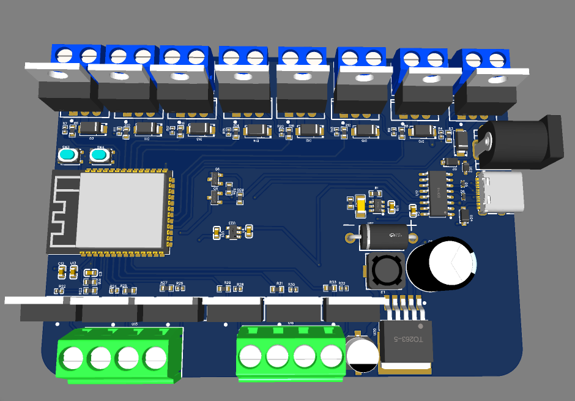
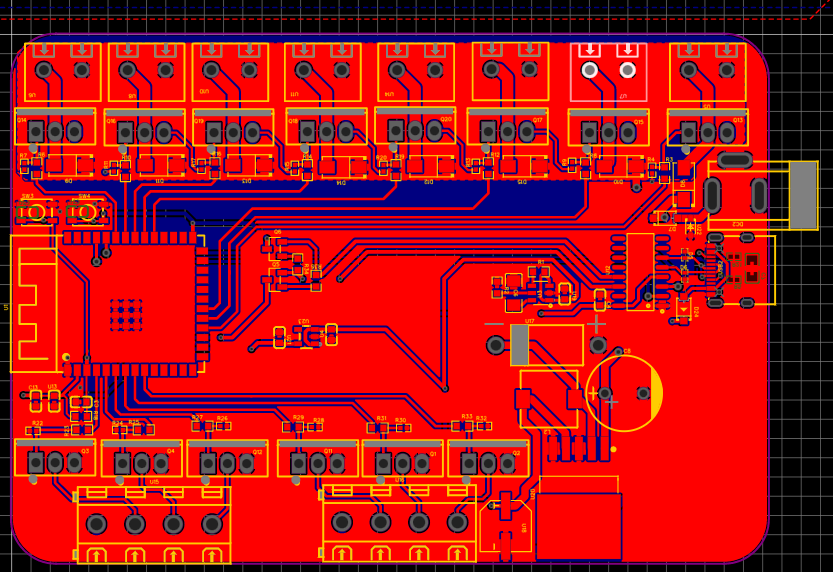
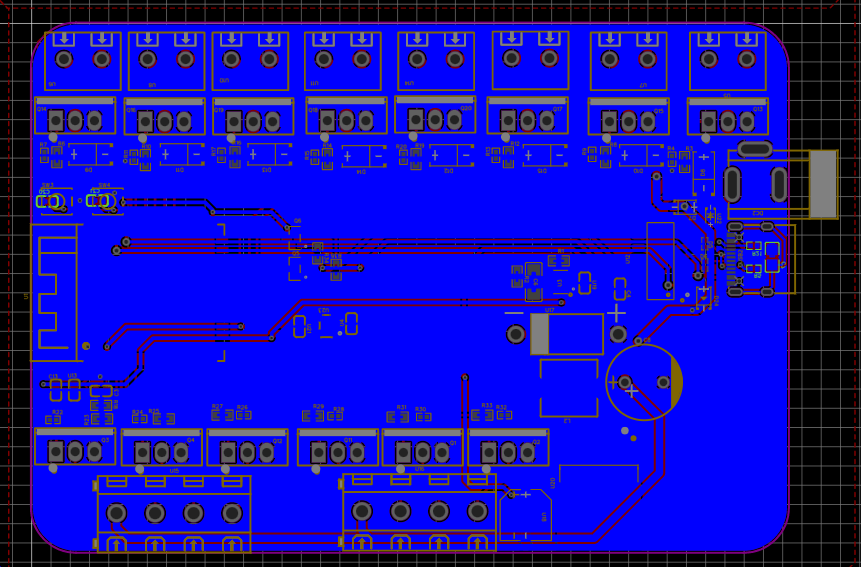
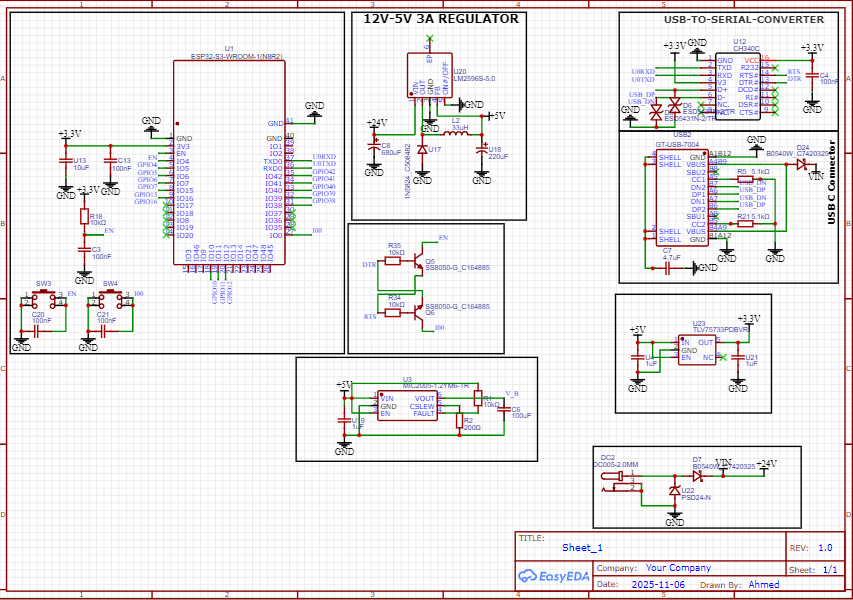
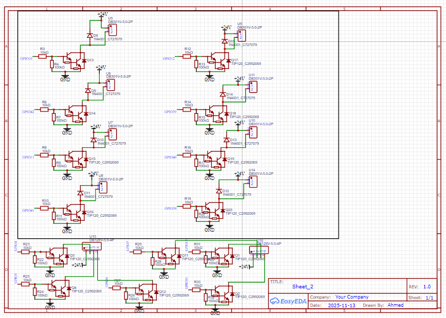

# ESP32-S3 High-Power 12-Channel Controller

## Description
This project is an industrial-grade control board based on the **ESP32-S3-WROOM-1** module. It is designed to switch and control up to 12 high-voltage loads (up to 24V) using Darlington transistors, making it ideal for automation and robotics.

## Key Features
* **Microcontroller:** ESP32-S3-WROOM-1 with Wi-Fi and Bluetooth.
* **Output Channels:** 12-channel power stage using **TIP120** Darlington transistors.
* **Voltage Support:** Designed for **24V** load switching.
* **Power Management:** Includes a **12V-5V 3A Regulator** circuit for stable internal power.
* **USB Connectivity:** USB Type-C interface with **CH340C** USB-to-Serial converter for easy programming.

---

## Project Gallery

### 1. 3D Preview

### 2. PCB Layout
#### Top Layer

#### Bottom Layer

### 3. Schematic Design
#### MCU, Power & USB-Serial

#### 12-Channel Output Stage

---

## Hardware Components
* **MCU:** ESP32-S3-WROOM-1.
* **Transistors:** TIP120 Darlington pairs.
* **Voltage Regulator:** LM2596S-5.0 (12V to 5V 3A).
* **USB Chip:** CH340C.
